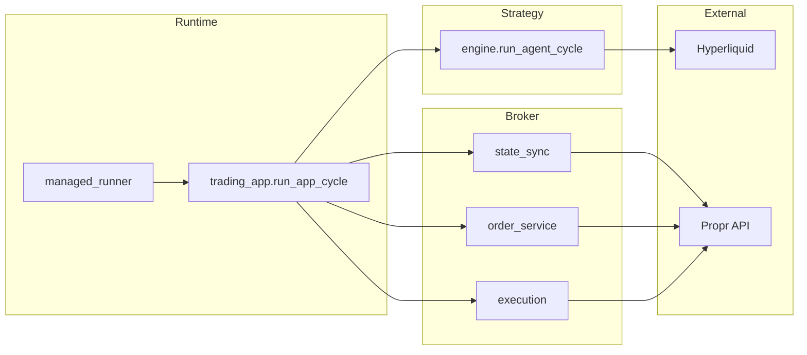

# Architecture manifest — Trading Agent

**Normative document.** Use this to challenge designs, diffs, and refactors: changes should respect the contracts below or update this file in the same pull request when the contract intentionally changes.

**Companion:** Operational setup, env vars, and day-to-day conventions live in [CLAUDE.md](../CLAUDE.md). This manifest focuses on **structure, dependencies, data flow, and safety invariants**.

---

## 1. Purpose and scope

**In scope**

- Rule-based trading loop: market data → regime/signals → decisions → (optional) Propr execution and journaling.
- Single-account, per-cycle orchestration via `app.trading_app.run_app_cycle`.
- Execution only through the **Propr** API; primary market data from **Hyperliquid** (REST; WebSocket possible later).

**Out of scope (by design today)**

- Multi-tenant or distributed execution.
- Guaranteed intrabar ordering, partial-fill simulation in strategy (see TODOs in code).
- Replacing CLAUDE.md; this file does not duplicate full env tutorials.

---

## 2. Layering rules (normative)

### 2.1 Package roles

| Layer | Path | Responsibility |
|--------|------|----------------|
| Runtime / orchestration | `app/` | One cycle: call strategy, guards, broker I/O, journal. Per-cycle helpers (sizing, beta submit rules, slot counts) live in `app/app_cycle_helpers.py`; `app/trading_app.py` remains the phase pipeline and public `run_app_cycle` entry. |
| Strategy | `strategy/` | Indicators-driven regime, signals, decisions, sizing logic; no direct HTTP to Propr. |
| Broker integration | `broker/` | Propr client/SDK, orders, execution helpers, state sync (facade), symbol/spec, health/asset guards, registry. Propr REST-shaped **payload parsing** is in `broker/propr_payload_parse.py`; **order/position → models** mapping in `broker/propr_order_position_map.py`; `broker/state_sync.py` composes them for `AgentState` and re-exports stable symbols (`map_propr_*`, `build_agent_state_from_propr_data`, `_get_items`, etc.). |
| Configuration | `config/` | Typed settings (Propr, Hyperliquid, strategy). |
| Domain models | `models/` | Shared Pydantic/dataclass types (candles, orders, state, journal entries). |
| Indicators | `indicators/` | Pure math (e.g. Bollinger, MACD). |
| Data access | `data/providers/` | `CandleDataProvider` implementations (live, golden, historical). |
| Utilities | `utils/` | Env loading, runtime status/overrides, operator tooling. Shared **Propr response JSON** helpers (`get_first_key`, `extract_external_order_id`) live in `utils/propr_response.py` — used by `app/` and `broker/` without importing each other for that concern. |

**Propr integration:** All HTTP/SDK calls to Propr go through **`broker/`** (`propr_client`, `order_service`, `state_sync`, `execution`, etc.). The published **`propr_sdk`** Python package is imported only from **`broker/propr_sdk.py`** — it is not a second app-layer tree.

### 2.2 Allowed dependency direction

- `models`, `config`, `indicators`: may be imported from any higher layer; they must not import `app`, `broker`, or `strategy` orchestration.
- `strategy` should depend on `models`, `config`, `indicators`, and `data` types — **not** on Propr HTTP clients or `app`.
- **Known exception:** `strategy/position_sizer.py` imports `broker.symbol_service` for quantity rounding. New code should avoid widening broker imports from `strategy`; prefer shared pure helpers in `models` or `utils` when tightening boundaries.
- `app` may import `strategy`, `broker`, `config`, `models`, `utils`.
- `broker` may import `config`, `models`, `utils`; must not import `app` or `strategy`.
- `data/providers` may import `config`, `models`; must not import `app` or `strategy`.

### 2.3 Propr I/O boundary

- **`app/trading_app.py`** uses **`broker.*`** for Propr execution and state sync, and **`utils.propr_response`** for shared REST response key / external order id extraction (no duplicate ad-hoc parsers in `app/`).
- Do not add a parallel in-repo package for Propr calls; extend **`broker/`** (and **`propr_sdk`** via `broker/propr_sdk.py` if the SDK surface changes).

---

## 3. Runtime and entry points

- **Production-style loop:** `managed_runner.py` → `deploy/raspberry_pi/managed_runner.py` → `run_app_cycle` from `app.trading_app`.
- **Other runners:** e.g. `scripts/scheduled_runner.py`, `scripts/propr_live_app_cycle.py` — same core cycle when they call `run_app_cycle`.
- **Tests and scripts:** `tests/`, `scripts/` (smoke, golden, scan, submit/cancel tests).
- **`main.py`:** Convenience / demo around `ProprClient`; **not** the main trading loop.

---

## 4. Data flow

1. **Input:** `DataBatch` from a `CandleDataProvider` (`data/providers/base.py`: candles, optional symbol, config, balance, active trade, `AgentState`).
2. **Strategy:** `strategy.engine.run_agent_cycle` runs signal/regime/decision logic and produces a `StrategyRunResult` (and order intent shapes as defined by models/strategy).
3. **State:** `broker.state_sync.sync_agent_state_from_propr` refreshes `AgentState` from Propr when the cycle uses live broker state. Implementation is split across `state_sync` (orchestration + `AgentState` build), `propr_order_position_map`, `propr_payload_parse`, and `utils.propr_response` for duplicated key/id logic — import **through** `broker.state_sync` (or `execution`’s existing imports) unless you are editing those internals.
4. **Execution:** Guards in `app` + `broker.execution` / `broker.order_service` submit, replace, or cancel on Propr as policy allows.
5. **Observability:** `app.journal` appends structured journal entries.

**Provider contract (invariant to preserve):** Implementations must return candles and metadata consistent with `CandleDataProvider.get_data()` → `DataBatch`. Changes to required fields, ordering, or timezone semantics must update providers, callers, and tests together.

---

## 5. Execution and safety invariants

These align with [CLAUDE.md](../CLAUDE.md); they are repeated here as **non-negotiable architecture constraints**.

- **Decimals:** Money and quantity paths in the broker layer use `Decimal`, not `float`.
- **Identifiers:** New orders use ULID as `intentId` where applicable. With `PROPR_STABLE_INTENT_ID=YES`, pending-entry previews built via `build_order_submission_preview` may use `derive_stable_intent_id(seed)` instead (opt-in; confirm Propr idempotency semantics before relying on it in prod).
- **Broker reconciliation:** If `submit_agent_order_if_allowed` finds an equivalent pending entry already at the broker, it returns `existing_external_order_id` without submitting again; `run_app_cycle` copies that id into `post_cycle_state.pending_order_id` and does not set `skipped_reason`, so journal and agent state stay aligned with Propr.
- **Partial fills:** When a symbol-scoped open position exists and a pending entry order is `partially_filled` / `partial_fill`, `build_agent_state_from_propr_data` does not attach that order as `pending_order` (the open position is the exposure source of truth); it remains counted in `account_open_entry_orders_count`.
- **Environments:** Default development on `PROPR_ENV=beta`. Production requires `PROPR_PROD_CONFIRM=YES` in `.env` (never commit that flag as enabled in examples).
- **Submit gates:** Real submits require explicit flags (`MANUAL_ALLOW_SUBMIT`, `RUNNER_ALLOW_SUBMIT`, `SCAN_ALLOW_SUBMIT`, etc., per context). **`DATA_SOURCE=golden` hard-blocks submit** regardless of flags.
- **SymbolSpec:** Live submit is blocked if symbol specification cannot be loaded.
- **HTTP success:** Treat `200` and `201` as success for create/cancel where applicable.
- **Rounding:** Quantity from `quantity_decimals` on `SymbolSpec`; price rounding only when `price_decimals` is available.
- **Positions:** `quantity == 0` positions are not treated as active trades after sync.
- **Beta limitation:** Standalone `BUY_STOP` / `SELL_STOP` entries may be rejected (`conditional_order_requires_position_or_group`, HTTP 400 / code 13056). `app/trading_app.py` blocks these submits on Beta up front; `scripts/propr_order_types_test.py` can still probe the API and, on success, confirm via WebSocket (orders) with REST fallback — keep this limitation visible in execution policy, not hidden inside strategy-only code.

---

## 6. Extension points

- **New signal or regime rule:** Implement inside `strategy/` using `models` and `config`; expose through `agent_cycle` / `decision_engine` as appropriate. Do not add Propr calls in `strategy/`.
- **New guard:** Add evaluation in `app/risk_guard.py`, `broker/asset_guard.py`, or `broker/health_guard.py` and invoke from `run_app_cycle` (or dedicated broker helper called from `app`).
- **New data source:** New class under `data/providers/` satisfying `CandleDataProvider`; wire via env/factory in the same places existing providers are selected.
- **New order type or mapper:** Extend `broker/order_service.py`, `broker/propr_sdk.py`, `broker/propr_order_position_map.py` / `broker/propr_payload_parse.py` as appropriate; keep `intentId` and Decimal rules. Prefer extending shared key/id helpers in `utils/propr_response.py` when both `app` and `broker` need the same response shape.

---

## 7. Anti-patterns

- Importing `ProprClient` or performing REST calls from `strategy/` or `indicators/`.
- Using `float` for sizes or prices in broker execution paths.
- Bypassing `run_app_cycle` guards “just for a script” without using the documented script flags and non-golden data rules.
- Adding a second in-repo integration path to Propr from `app/` (bypassing `broker/`) without updating this manifest.
- Committing credentials, production confirm flags, or `artifacts/` contents intended to stay local.

---

## 8. Change checklist (PR / design review)

Answer explicitly when touching cycle behavior, layering, or execution policy:

- [ ] Does the change respect the dependency direction in §2 (no new forbidden imports)?
- [ ] Does new Propr-related code live under `broker/` (or justified changes to `broker/propr_sdk.py`), not in `app/` or `strategy/`?
- [ ] Are submits still impossible under `DATA_SOURCE=golden`?
- [ ] Are new quantity/price paths using `Decimal` in the broker layer?
- [ ] Do tests cover the new branch without requiring real Propr prod?
- [ ] If public cycle behavior or safety rules changed, is **this manifest** (or CLAUDE.md for ops-only detail) updated in the same PR?
- [ ] If execution reconciliation, partial-fill state, or optional stable `intentId` behavior changed, are §5 invariants and affected tests updated?

---

## Maintenance rule

Any pull request that changes **public per-cycle behavior**, **layer imports**, or **submit/safety policy** must update this manifest in the same PR when the architectural contract changes. Purely internal refactors that preserve the above contracts do not require manifest edits.

**Version:** Document creation tracks repository state; bump or date this section when making substantive contract changes. **2026-04:** Orchestration split documented — `app/app_cycle_helpers.py`, `utils/propr_response.py`, `broker/propr_payload_parse.py`, `broker/propr_order_position_map.py`, thinner `broker/state_sync.py` facade; dependency rules in §2.2 unchanged. **2026-04 (later):** Execution reconciliation (`SubmitAgentOrderResult.existing_external_order_id`), optional `PROPR_STABLE_INTENT_ID` + `derive_stable_intent_id`, partial-fill pending omission when a position exists for the symbol.
